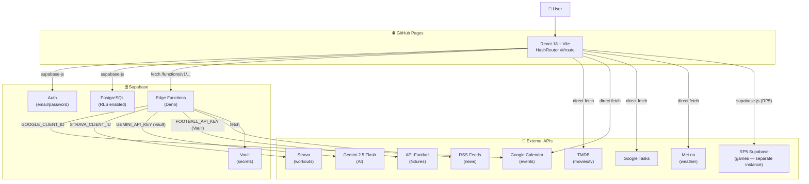
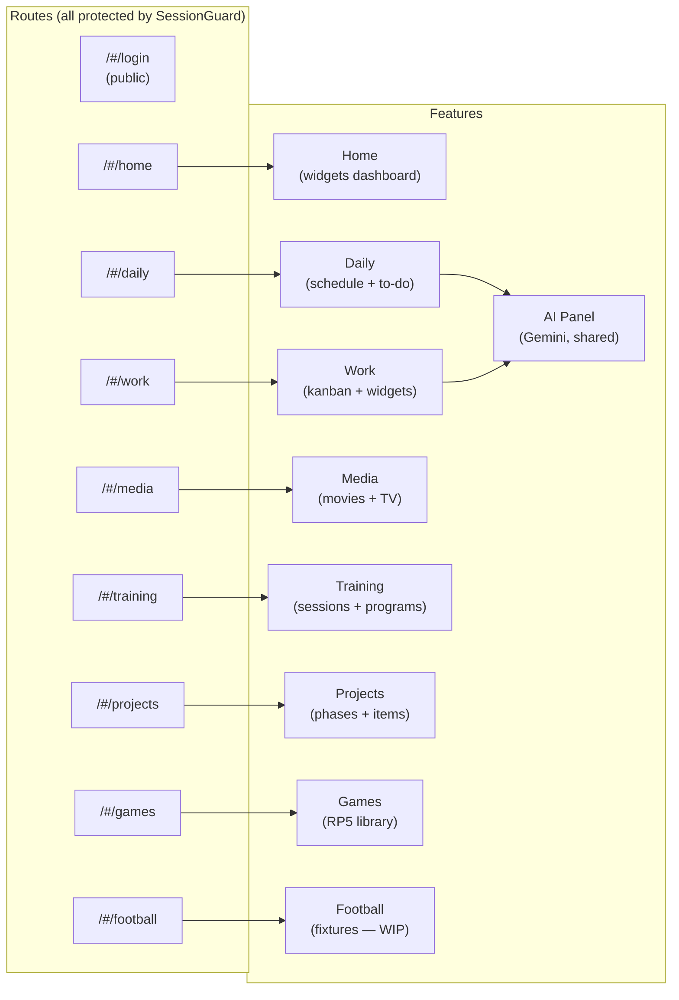
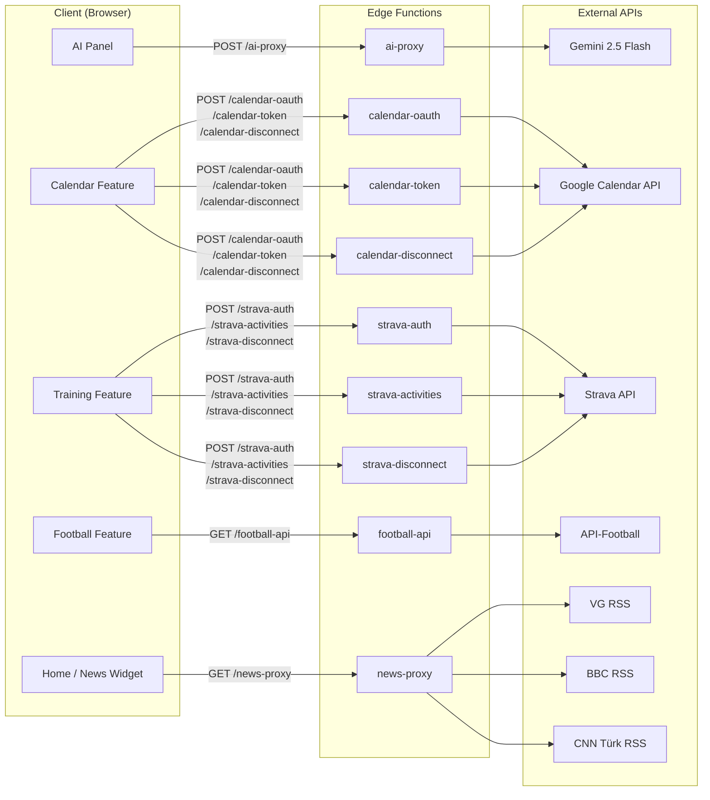
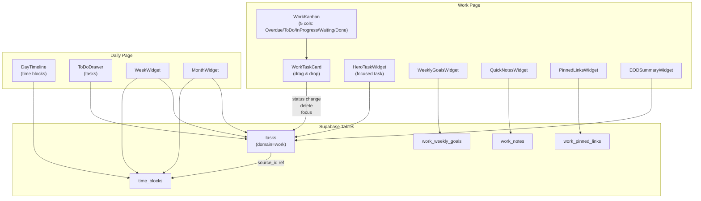
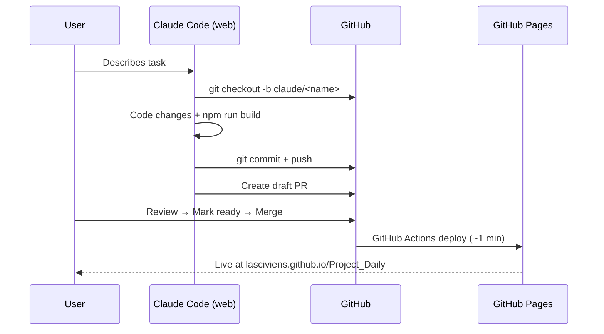

# Project Daily — Workflow Diagram

> Paste any diagram block into https://mermaid.live to render it.

---

## 1. App Architecture Overview

---

## 2. Routes & Features

---

## 3. Database Schema

```mermaid
erDiagram
  auth_users {
    uuid id PK
  }

  tasks {
    uuid id PK
    uuid user_id FK
    text title
    text domain "personal|work|media"
    text section "inbox|today|this_week|backlog"
    text status "open|in_progress|waiting|done|cancelled"
    text priority "low|medium|high"
    text waiting_for
    date due_date
    int sort_order
    text google_task_id
    text google_calendar_event_id
  }

  time_blocks {
    uuid id PK
    uuid user_id FK
    date date
    time start_time
    text title
    text source_type "task|training_session|movie|tv_episode|calendar|manual"
    uuid source_id FK
    text notes
  }

  schedule_blocks {
    uuid id PK
    uuid user_id FK
    text title
    time start_time
    text days "MON,TUE,..."
    text color
  }

  movies {
    uuid id PK
    int tmdb_id
    text title
    text poster_path
    date release_date
  }

  user_movie_entries {
    uuid id PK
    uuid user_id FK
    uuid movie_id FK
    text status "wishlist|watched|skipped"
    text priority
    date watched_at
  }

  tv_series {
    uuid id PK
    int tmdb_id
    text title
  }

  user_tv_entries {
    uuid id PK
    uuid user_id FK
    uuid tv_series_id FK
    text status
    text priority
  }

  projects {
    uuid id PK
    uuid user_id FK
    text name
    text status
  }

  project_phases {
    uuid id PK
    uuid project_id FK
    text name
    int sort_order
  }

  project_items {
    uuid id PK
    uuid phase_id FK
    text title
    text status
    text type
  }

  train_sessions {
    uuid id PK
    uuid user_id FK
    text workout_type
    date date
    int duration_min
    text strava_id
  }

  train_programs {
    uuid id PK
    uuid user_id FK
    text name
    text description
  }

  train_program_workouts {
    uuid id PK
    uuid program_id FK
    text name
    int day_number
  }

  train_program_exercises {
    uuid id PK
    uuid workout_id FK
    text exercise_name
    int sets
    int min_reps
    int max_reps
  }

  train_exercises {
    uuid id PK
    text name
    text category
    text muscle_group
  }

  train_session_exercises {
    uuid id PK
    uuid session_id FK
    text exercise_name
    jsonb sets_data
  }

  user_transit_stops {
    uuid id PK
    uuid user_id FK
    text stop_id
    text stop_name
    text role "from|to"
  }

  user_transit_routes {
    uuid id PK
    uuid user_id FK
    uuid from_stop_id FK
    uuid to_stop_id FK
    text label
  }

  work_notes {
    uuid id PK
    uuid user_id FK
    text content
  }

  work_pinned_links {
    uuid id PK
    uuid user_id FK
    text title
    text url
    int sort_order
  }

  work_weekly_goals {
    uuid id PK
    uuid user_id FK
    date week_start
    text title
    bool done
  }

  auth_users ||--o{ tasks : owns
  auth_users ||--o{ time_blocks : owns
  auth_users ||--o{ schedule_blocks : owns
  auth_users ||--o{ user_movie_entries : owns
  auth_users ||--o{ user_tv_entries : owns
  auth_users ||--o{ projects : owns
  auth_users ||--o{ train_sessions : owns
  auth_users ||--o{ train_programs : owns
  auth_users ||--o{ work_notes : owns
  auth_users ||--o{ work_pinned_links : owns
  auth_users ||--o{ work_weekly_goals : owns
  movies ||--o{ user_movie_entries : referenced_by
  tv_series ||--o{ user_tv_entries : referenced_by
  projects ||--o{ project_phases : has
  project_phases ||--o{ project_items : has
  train_programs ||--o{ train_program_workouts : has
  train_program_workouts ||--o{ train_program_exercises : has
  train_sessions ||--o{ train_session_exercises : has
```

---

## 4. Edge Functions & External API Calls

---

## 5. Daily / Work Data Flow

---

## 6. Session Workflow

