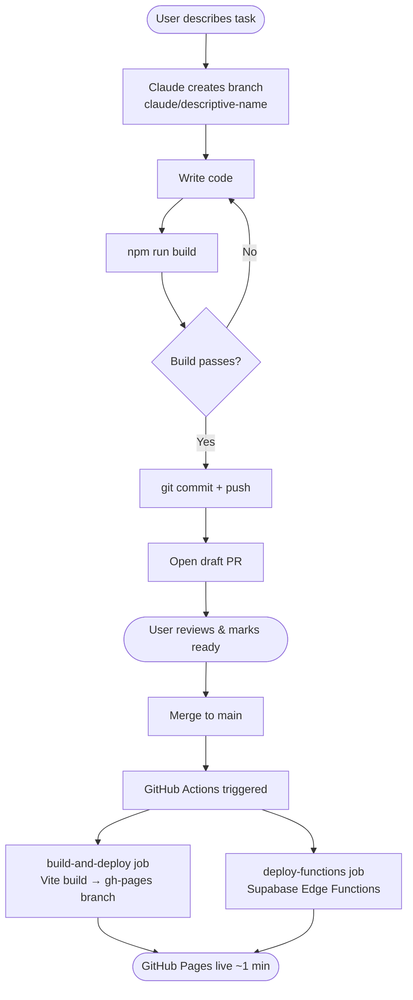
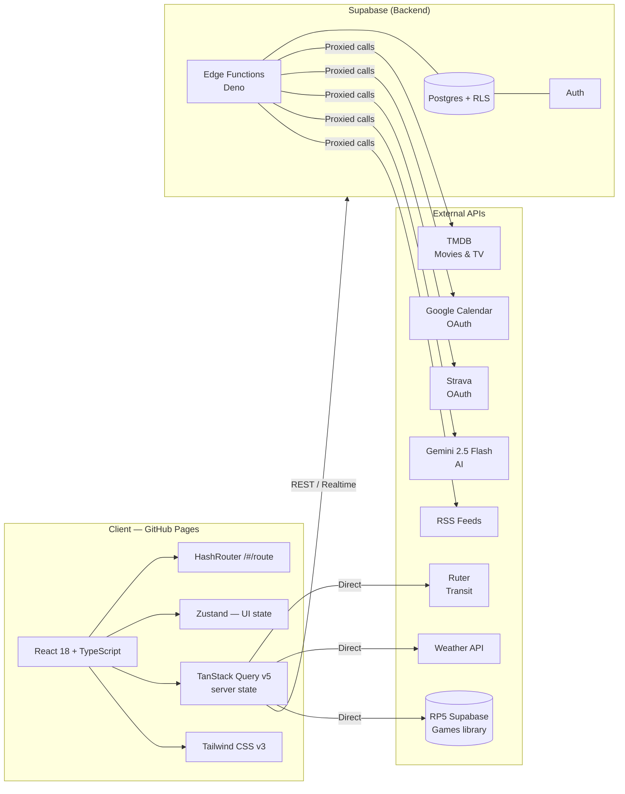
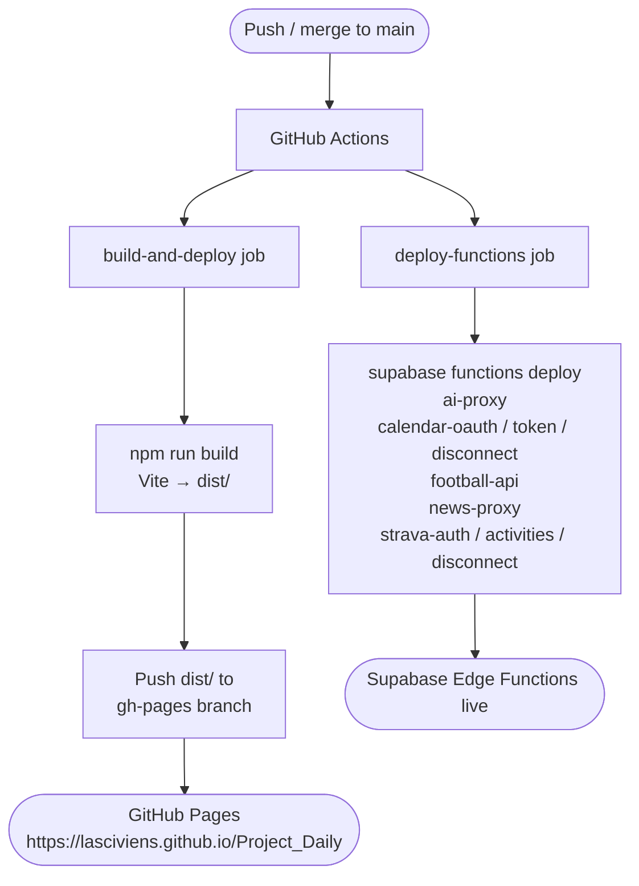

# Lasci's Board

A personal dashboard built with React + Supabase — daily planning, media tracking, calendar, training, games, work tasks, and more, all in one place.

**Live app:** https://lasciviens.github.io/Project_Daily/#/login  
**Repo:** https://github.com/Lasciviens/Project_Daily

---

## Development Workflow

Every session runs inside a fresh container on [Claude Code on the web](https://claude.ai/code). Git is the only persistent memory between sessions.



> **Never push directly to `main`.** All changes go through a PR.

---

## Tech Architecture



---

## Features

| Feature | Status | Notes |
|---|---|---|
| Auth | ✅ | Login page, Supabase Auth |
| Daily + To-Do | ✅ | DayView, DayTimeline, WeekWidget, MonthWidget, AddTimeBlockModal, ToDoDrawer |
| Media | ✅ | TMDB, Movies + TV, PlanThisButton, TonightPicker, ReleaseCalendar |
| Work | ✅ | Task board |
| AI | ✅ | Gemini 2.5 Flash via Edge Function, `create_task` function calling |
| Calendar | ✅ | Google OAuth, read + write events, sync/refresh button in DayTimeline header |
| Games | ✅ | RP5 library proxy, 6 view modes, TierEditor, PlayQueue drag-and-drop |
| Training | ✅ | Strava OAuth, workout logging, week view |
| Projects | ✅ | Phases, items, status tracking |
| Home | ✅ | WidgetShell, Weather, Ruter transit, Currency, News, Recent Media, Games, Training |
| Football | ⚠️ | Page + UI built. API-Football free tier only covers up to 2024. Plan: pull fixtures from Google Calendar instead. |

**Planned / not done yet:**
- Football data source (Google Calendar integration planned)
- Command Bar (Cmd+K)
- Activity Log / stats widget
- Dark Mode (dark/light toggle)

---

## Routes

```
/#/login      → LoginPage        (public)
/#/home       → HomePage
/#/daily      → DailyPage
/#/media      → MediaPage
/#/work       → WorkPage
/#/projects   → ProjectsPage
/#/training   → TrainingPage
/#/games      → GamesPage
/#/football   → FootballPage
```

All routes except `/#/login` are protected by `SessionGuard` in `src/app/router.tsx`.

---

## Deployment Pipeline



---

## Quick Start

```bash
# Install dependencies
npm install

# Start dev server (http://localhost:5173)
npm run dev

# Type-check + build
npm run build
```

### Environment variables

Create a `.env.local` at the project root:

| Variable | Purpose |
|---|---|
| `VITE_SUPABASE_URL` | Main Supabase project URL |
| `VITE_SUPABASE_ANON_KEY` | Main Supabase anon key |
| `VITE_TMDB_API_KEY` | TMDB API key (client-safe) |
| `VITE_GOOGLE_CLIENT_ID` | Google OAuth client ID for Calendar |
| `VITE_RP5_SUPABASE_URL` | RP5 games Supabase URL |
| `VITE_RP5_SUPABASE_ANON_KEY` | RP5 games Supabase anon key |

AI keys (`CLAUDE_API_KEY`, `OPENAI_API_KEY`) live in Supabase Vault only — never in the client.

### Branch naming

```
claude/<descriptive-name>   # e.g. claude/add-weather-widget
```

Never commit directly to `main`.
