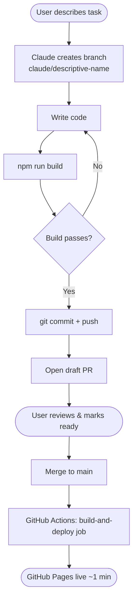
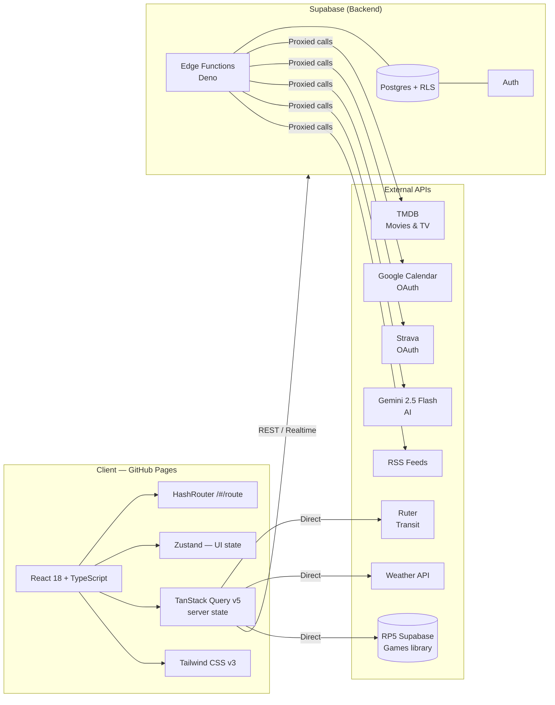
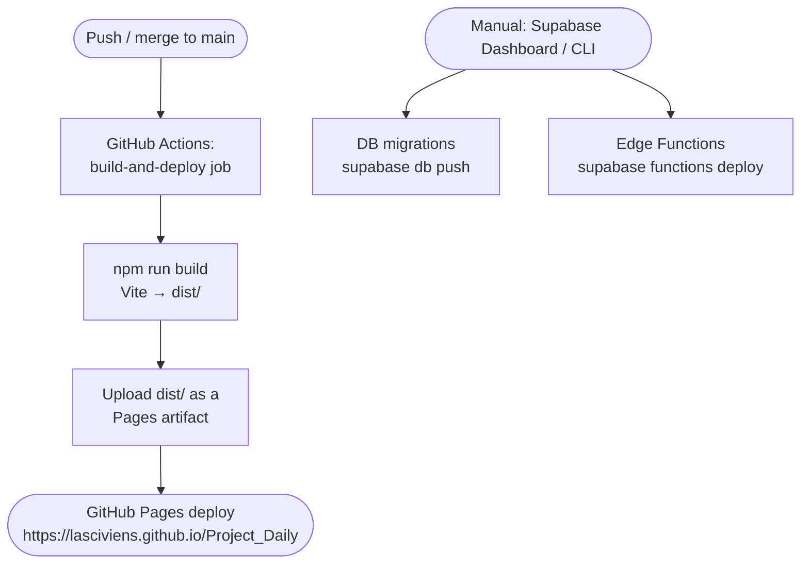

# Lasci's Board

A personal dashboard built with React + Supabase — daily planning, media tracking, calendar, training, games, work tasks, and more, all in one place.

**Live app:** https://lasciviens.github.io/Project_Daily/#/login  
**Repo:** https://github.com/Lasciviens/Project_Daily

---

## Development Workflow

Every session runs inside a fresh container on [Claude Code on the web](https://claude.ai/code). Git is the only persistent memory between sessions.



> **Never push directly to `main`.** All changes go through a PR.
> GitHub Actions only builds and deploys the **frontend**. Database migrations
> and Supabase Edge Functions are deployed **manually** (see `AGENTS.md` and
> CLAUDE.md's Edge Functions section) — there is no CI job for either.

---

## Tech Architecture



---

## Features

Daily planning + to-do, shop/wishlist, recipes, media tracking (movies/TV via
TMDB), a work task board, Google Calendar sync, a games library, training
(Hevy + Strava + Apple Health via Health Auto Export), projects, and an
in-app AI assistant with generic database read/write access.

**Feature status is tracked in `CLAUDE.md`'s Features table, not here** — that
file is updated every session and is the current source of truth; duplicating
per-feature status here would just go stale.

---

## Routes

```
/#/login      → LoginPage      (public)
/#/home       → HomePage
/#/daily      → DailyPage      (Personal tab bar: Daily / Shop / Recipes)
/#/shop       → ShopPage       (Personal tab bar)
/#/recipes    → RecipesPage    (Personal tab bar)
/#/media      → MediaPage
/#/work       → WorkPage
/#/projects   → ProjectsPage
/#/training   → TrainingPage
/#/games      → GamesPage
/#/developer  → DeveloperPage  (reached via the Settings ⚙ menu)
```

Football has no route yet — deferred (see CLAUDE.md's Features table for why).
All routes except `/#/login` are protected by `SessionGuard` in `src/app/router.tsx`.

---

## Deployment Pipeline



Only the frontend build is automated (via the official `actions/deploy-pages`
mechanism, not a `gh-pages` branch). Database migrations and Edge Functions
are **always deployed manually** — see `AGENTS.md` and CLAUDE.md's Edge
Functions table for the full list of functions and why this isn't automated
yet.

---

## Quick Start

```bash
# Install dependencies
npm install

# Start dev server (http://localhost:5173)
npm run dev

# Type-check + build
npm run build
```

### Environment variables

Create a `.env.local` at the project root:

| Variable | Purpose |
|---|---|
| `VITE_SUPABASE_URL` | Main Supabase project URL |
| `VITE_SUPABASE_ANON_KEY` | Main Supabase anon key |
| `VITE_TMDB_API_KEY` | TMDB API key (client-safe) |
| `VITE_GOOGLE_CLIENT_ID` | Google OAuth client ID for Calendar |
| `VITE_RP5_SUPABASE_URL` | RP5 games Supabase URL |
| `VITE_RP5_SUPABASE_ANON_KEY` | RP5 games Supabase anon key |

AI keys (`CLAUDE_API_KEY`, `OPENAI_API_KEY`) live in Supabase Vault only — never in the client.

### Branch naming

```
claude/<descriptive-name>   # e.g. claude/add-weather-widget
```

Never commit directly to `main`.

<!-- merge diagnostic test, safe to delete -->
