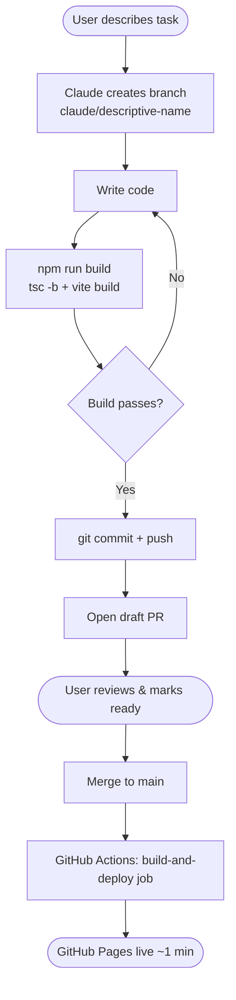
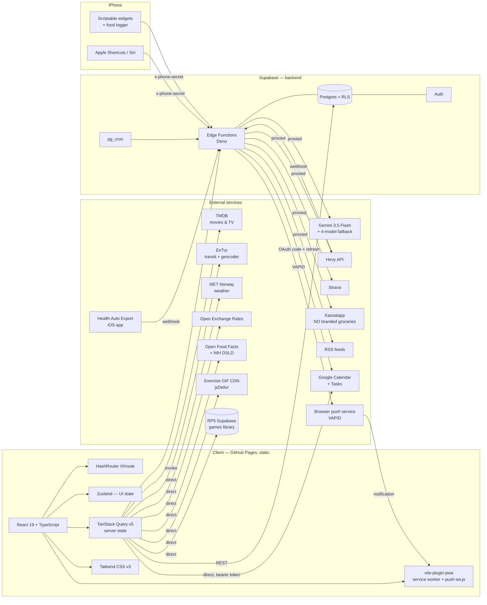
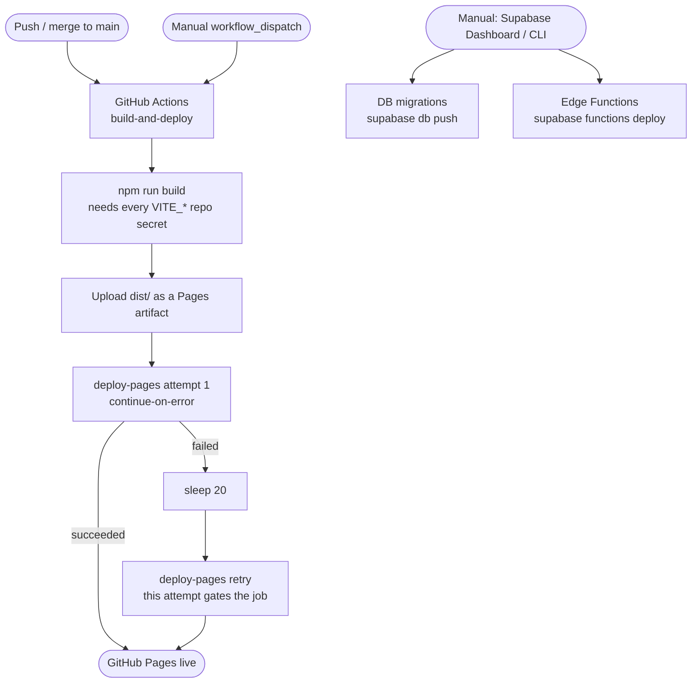

# Lasci's Board

A single-user personal dashboard built with React + Supabase. It covers daily
planning and to-dos, a food/nutrition diary with bodyweight-driven coaching,
media tracking (movies/TV via TMDB), a work task board, projects, a games
library, training and health (Hevy, Strava, Apple Health), Google Calendar
sync, Oslo transit and weather, an AI
assistant with generic database access, an iPhone control surface (Shortcuts,
Siri, Scriptable widgets) and lock-screen push notifications.

**Live app:** https://lasciviens.github.io/Project_Daily/#/login
**Repo:** https://github.com/Lasciviens/Project_Daily

---

## Documentation

| Read this | For |
|---|---|
| [`CLAUDE.md`](CLAUDE.md) | The agent bible — current feature + architecture state, coding rules, edge-function inventory, key patterns. Updated every session; it wins on any disagreement. |
| [`AGENTS.md`](AGENTS.md) | Database/schema/Supabase rules: migrations, RLS, edge-function conventions. |
| [`docs/README.md`](docs/README.md) | Index of the deep-dive docs — setup runbooks, the cross-AI coordination channel, and verified API references. |
| [`supabase/migrations/`](supabase/migrations) | The schema source of truth. There is no separate data-model document. |
| In-app **Dev Requests** drawer | The live backlog (`dev_requests` table), not a markdown list. |

iPhone side specifically: [`docs/iphone-examples.md`](docs/iphone-examples.md)
(gateway action contract + Shortcut recipes),
[`docs/iphone-web-integration.md`](docs/iphone-web-integration.md) (why it is
built this way + iOS platform limits),
[`docs/scriptable-food-logger.md`](docs/scriptable-food-logger.md),
[`docs/scriptable-widgets.md`](docs/scriptable-widgets.md),
[`docs/web-push-setup.md`](docs/web-push-setup.md).

---

## Development Workflow

Every session runs inside a fresh container on [Claude Code on the web](https://claude.ai/code). Git is the only persistent memory between sessions.



> **Never push directly to `main`.** All changes go through a PR.
> GitHub Actions only builds and deploys the **frontend**. Database migrations
> and Supabase Edge Functions are deployed **manually** (see `AGENTS.md` and
> CLAUDE.md's Edge Functions section) — there is no CI job for either.

---

## Tech Architecture



Two things the diagram is deliberate about:

- **Only secrets go through Edge Functions.** TMDB, EnTur, MET Norway, Open
  Exchange Rates, Open Food Facts, NIH DSLD, the GIF CDN and the RP5 games
  project are called straight from the browser with client-safe keys. Google
  Calendar is split: the OAuth code exchange and refresh run in
  `calendar-oauth`/`calendar-token`, while the Calendar and Tasks API calls
  themselves are direct from the client with the bearer token.
- **`pg_cron` is load-bearing**, not decoration: it drives the morning Web Push
  brief.

---

## Features

Daily planning + to-dos, a unified food diary (meal plan, macros/fiber/sugar,
barcode + online food search, supplements, water) with a bodyweight-driven
nutrition coach, a shop/wishlist, media tracking (movies/TV via TMDB with
per-episode progress), a work kanban/list board, projects, a games library,
training and health (Hevy workouts/routines/PRs, Strava, Apple Health via
Health Auto Export, plus an AI PT coach), Google Calendar sync, Oslo transit
and weather, a Developer page (audit trail +
error logs) and an in-app Dev Requests backlog.

Cross-cutting surfaces:

- **AI assistant** — Gemini through the `ai-proxy` edge function: generic
  allow-listed database read/write, server-side aggregation, day summaries,
  photo (vision) input, pgvector semantic search, durable memory, an opt-in
  read-only live-SQL escape hatch, per-surface model routing and usage logging.
- **iPhone surface** — the `phone-gateway` edge function is the one durable
  entry point (authenticated by a device secret, acting as the single user
  server-side). It exposes deterministic actions (`log_supplement`, `log_food`,
  `log_water`, `nutrition_today`, `recent_foods`, `search_library`,
  `sleep_stats`, `tasks_today`) plus AI actions (`ask`, `brief`, `sleep`)
  forwarded to `ai-proxy`. On top of it: 11 generated Apple Shortcuts, a
  Scriptable food logger and four home-screen widgets.
- **Web Push** — a `pg_cron` job calls `push-send`, which signs a VAPID push so
  the morning brief reaches the lock screen while the app is closed.
- **Installable PWA** — service worker with auto-update, pull-to-refresh, a
  mobile app shell with a floating tab bar, dark mode and a ⌘K command bar.

**Feature status is tracked in `CLAUDE.md`'s Features table, not here** — that
file is updated every session and is the current source of truth; duplicating
per-feature status here would just go stale.

---

## Routes

```
/#/login          → LoginPage          (public)
/#/reset-password → ResetPasswordPage  (public — reached from the Supabase
                                        recovery email or "Forgot password?")
/#/home           → HomePage
/#/daily          → DailyPage    (nav: "Personal" — Daily only, no in-page tabs)
/#/recipes        → RecipesPage  (nav: "Food" — in-header Food | Shop tabs)
/#/shop           → ShopPage     (same "Food" nav group and tabs)
/#/media          → MediaPage
/#/work           → WorkPage
/#/projects       → ProjectsPage
/#/training       → TrainingPage
/#/games          → GamesPage
/#/developer      → DeveloperPage      (reached via the Settings ⚙ menu)
```

Desktop nav order is Home · Personal · Food · Media · Work · Training ·
Projects · Games. The route stays `/#/recipes`, but the UI calls it **Food** —
paths were kept stable through the nav restructure so existing deep links still
work.

Everything except `/#/login` and `/#/reset-password` is behind `SessionGuard`
(`src/app/router.tsx`). Football has no route — deferred (see CLAUDE.md's
Features table for why).

---

## Repository layout

```
src/app/            router.tsx · layout.tsx (nav + app shell) · providers.tsx · store.ts (Zustand)
src/features/       one folder per feature: ai auth calendar daily devRequests developer
                    games home media personal projects recipes(=Food) shop todo training work
src/shared/         shared components (incl. UnifiedPlanModal, CommandBar), hooks, utils
src/integrations/   supabase · tmdb · rp5-library (second Supabase project, games)
src/security/       sessionGuard.tsx · supabaseClient.ts
supabase/functions/ Deno edge functions — each self-contained, deployed manually
supabase/migrations/ numbered .sql migrations — applied manually
scripts/            generators + verification scripts, incl. iphone-shortcuts/ (Codex-owned)
public/             PWA assets + push-sw.js (Web Push service-worker handlers)
docs/               runbooks, coordination logs, API references — see docs/README.md
.github/workflows/  deploy.yml — the only CI job (frontend build + Pages deploy)
```

There is no unit-test framework in this repo (`@playwright/test` is the only
test dependency); one-off logic verification ships as a throwaway script under
`scripts/`.

---

## Deployment Pipeline



Notes on the pipeline, all in `.github/workflows/deploy.yml`:

- Only the frontend build is automated, via the official `actions/deploy-pages`
  mechanism (not a `gh-pages` branch). Database migrations and Edge Functions
  are **always deployed manually** — see `AGENTS.md` and CLAUDE.md's Edge
  Functions table.
- The Pages deploy step is intermittently flaky, so attempt 1 runs with
  `continue-on-error` and only the retry gates the job. A red-then-green run is
  expected behaviour, not a broken build.
- `concurrency: { group: pages, cancel-in-progress: false }` — deploys queue
  instead of cancelling each other.
- The build reads its `VITE_*` values from **GitHub Actions secrets**. A missing
  one produces a broken deploy rather than a failed build, because most of them
  only fail at call time.

---

## Quick Start

```bash
npm install

# Dev server (http://localhost:5173)
npm run dev

# Type-check + build (what CI runs)
npm run build

# Lint
npm run lint
```

### Environment variables

Create a `.env.local` at the project root. (`.env.example` and
`.env.local.example` exist but are both out of date — use the table below.)

| Variable | Purpose | Required? |
|---|---|---|
| `VITE_SUPABASE_URL` | Main Supabase project URL | **Yes** — the app throws at import without it |
| `VITE_SUPABASE_ANON_KEY` | Main Supabase anon key | **Yes** — same |
| `VITE_TMDB_API_KEY` | TMDB key, client-safe | Media features throw at call time without it |
| `VITE_GOOGLE_CLIENT_ID` | Google OAuth client ID — one consent covering Calendar and Tasks | Optional; Google features are hidden without it |
| `VITE_STRAVA_CLIENT_ID` | Strava OAuth client ID | Optional; Strava connect only |
| `VITE_OXR_APP_ID` | Open Exchange Rates app id | Optional; the Currency widget errors without it |
| `VITE_RP5_SUPABASE_URL` | RP5 games Supabase URL | Optional; Games is disabled without it |
| `VITE_RP5_SUPABASE_ANON_KEY` | RP5 games Supabase anon key | Optional; same |
| `VITE_VAPID_PUBLIC_KEY` | Web Push **public** key, safe to expose | Optional; push subscribe is unavailable without it |

All nine are set as GitHub Actions secrets for the deploy build.

Server-side secrets live in **Supabase Vault / Edge Function secrets only,
never in the client** — the Gemini API key (`GEMINI_API_KEY`), Google OAuth
client secret, `HEVY_*`, `HEALTH_EXPORT_WEBHOOK_SECRET`,
`KASSALAPP_API_KEY`, `PHONE_GATEWAY_SECRET`,
`VAPID_PRIVATE_KEY`/`VAPID_SUBJECT`, `PUSH_CRON_SECRET`, `STRAVA_CLIENT_SECRET`.
CLAUDE.md's Environment Variables table is the full list.

---

## Working in this repo

- **Never commit directly to `main`.** Branch as `claude/<descriptive-name>`
  (e.g. `claude/add-weather-widget`) and open a PR.
- **English only in every repo artifact** — code, comments, UI strings, commit
  messages, PR text, docs. The single exception is Turkish inside the generated
  iPhone shortcuts' and widgets' on-phone user-facing strings, which is the
  personal-device UX language.
- **Two AI agents work this repo.** Claude is the manager and owns `src/**`,
  `supabase/**`, migrations and all of `docs/**`. **Codex owns
  `scripts/iphone-shortcuts/**` and nothing else.** Tasks flow through
  [`docs/codex-shortcuts.md`](docs/codex-shortcuts.md); messages flow through
  two append-only logs described in
  [`docs/coord/README.md`](docs/coord/README.md). Never generate shortcuts with
  a real `x-phone-secret` committed — the checked-in source uses a placeholder.
- **Layout is content-sized, mobile-first.** Before building any widget, read
  CLAUDE.md's "Layout width" and "Width Standard" rules and its reference
  viewports (mobile 852×393, laptop 1469×680, monitor 2450×1130) — nothing is
  stretched edge-to-edge here.
- Dates are always `en-GB` (DD/MM/YYYY).
